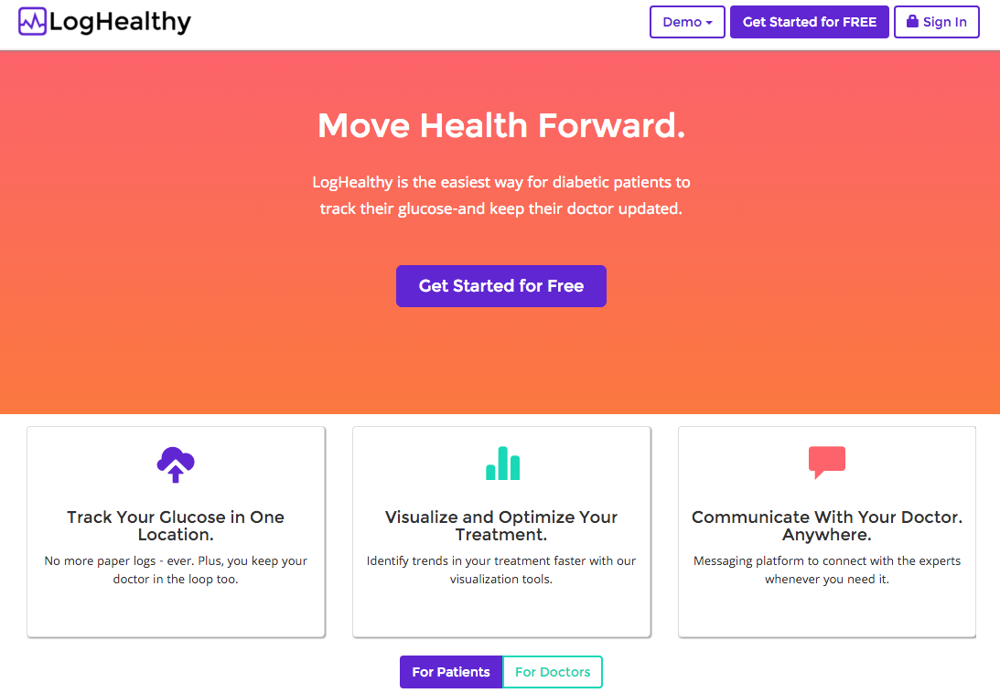
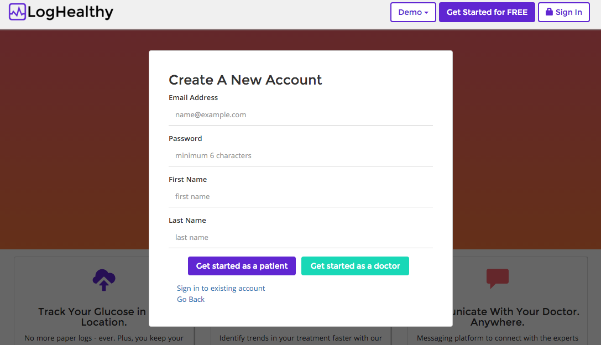
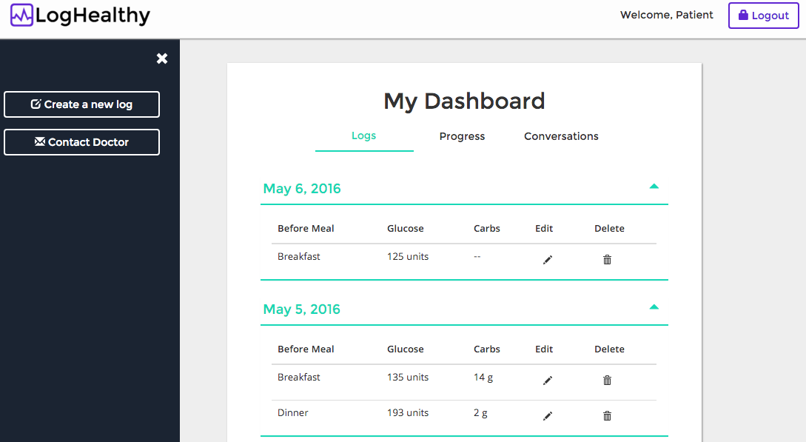
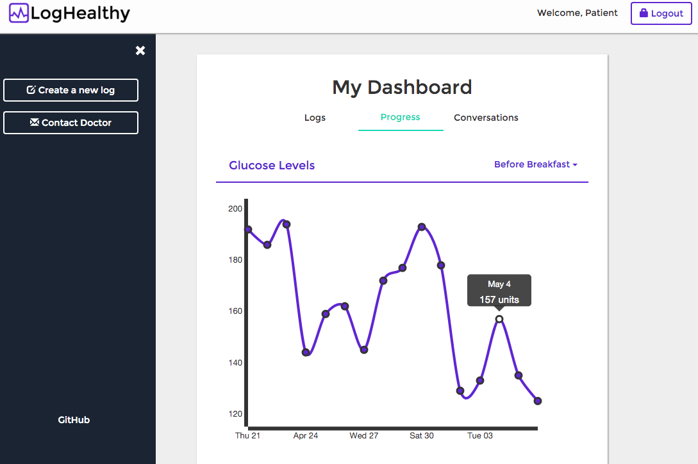
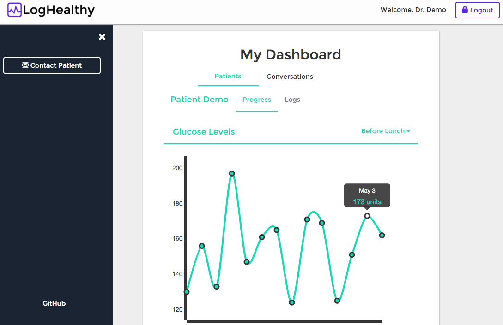
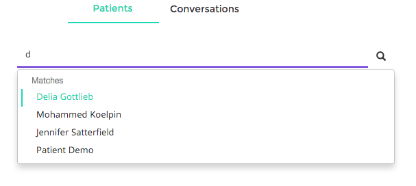
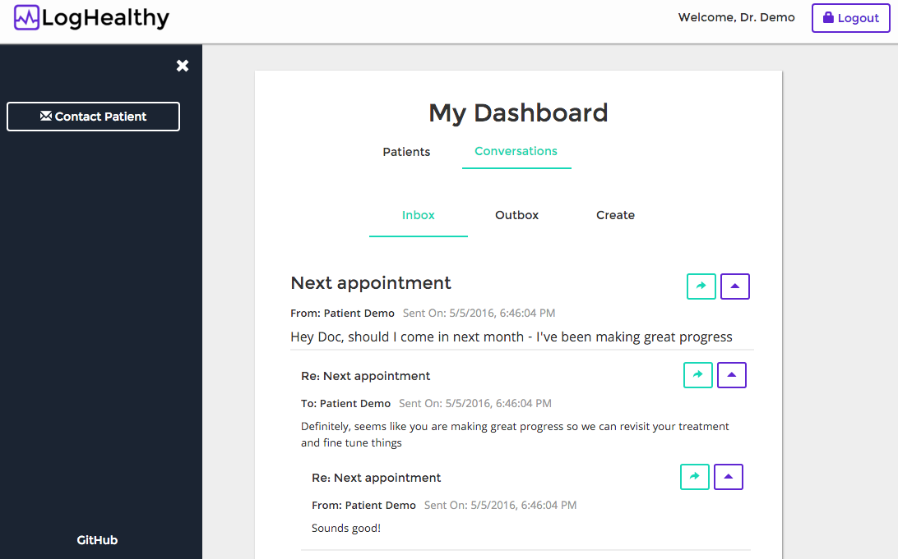

# LogHealthy

[LogHealthy Live Demo][heroku]

[heroku]: http://www.loghealthy.com

LogHealthy is a full-stack web application inspired by Asana that is tailored for diabetic patients and their doctors.  It utilizes Ruby on Rails on the backend, a PostgreSQL database, and React.js with a Flux architectural framework on the frontend.



## Features & Implementation

### Single-Page Health Tracking App

LogHealthy is truly a single-page; all functionality is delivered on one static page. Users can log in as either a patient to document diabetes progress or as a doctor to view their patients' progress.

Because the application provides different content to patients and doctors, it offers a single sign-on portal that renders content based on the type of user that signs in.



The root page listens to a `PatientStore` and a `DoctorStore` and renders content based on a call to `.currentPatient()` or `.currentDoctor()`.  Sensitive information is kept out of the frontend of the app by making an API call to `SessionsController#show`.

### Log Rendering and Editing for Patients

Patients track diabetes progress by creating Logs which track their glucose (blood sugar) levels before each meal that they have. Logs can also store additional information regarding whether or not they ate a meal, and their expected carb intake for the meal.



On the frontend, logs are shown on a daily basis with each day having a table of logs. Each row represents a log, one for each meal of the day. Upon clicking a log, additional details appear. There are also buttons to edit and delete each log.

On the database side, the logs are stored in one table in the database, which contains columns for `id`, `patient_id`, `glucose`, `meal_type`, `meal_taken`, `comments` and `date`. Logs are joined with their Patient on `patient_id`.

Upon login of patient, the API call that is made to the database to fetch the patient will also fetch all of their logs. The `PatientStore` on the frontend will hold the patient and can access the logs as a key within the the patient object until the current session is destroyed.

Since the logs are rendered by `date` and then by `meal_type`, a `Patient#logs_hash` method was implemented to create an object of logs that matched the needs of the frontend while minimizing server requests and/or rendering time due to the tabular structure of the content.

```ruby
class Patient < ActiveRecord::Base
  def logs_hash
    results = {}

    self.logs.order("date DESC").each do |log|
      date = log.date.to_formatted_s(:long)
      results[date] = {} if results[date].nil?
      results[date][log.meal_type] = log
    end

    results
  end
end
```

### Progress for Patients

The progress tab when logged in as a patient allows the user to visualize their progress in a time-series. Users can also toggle the meal type to display different sets of data. Hovering over data points will show data specific to that date.



The graph is rendered using the D3 javascript library within react components. `GlucoseChart` is the main react component that takes `glucose` as a prop that contains the logs taken from `PatientStore`. `LineChart`, `Grid`, `Axix` subcomponents are used to generate the time-series line, datapoints, and tool-tips (when hovering). The `LineChart` parses `glucose` into an array and scales the `Axix` based on the data so that all logs appear in the graph.

Because the log data is already fetched and stored in the `PatientStore` no additional server requests are needed to display the data.

### Patients View for Doctors

When doctors log in, they have the ability to view all of their patients data. This is done by searching by the patient's name in the search bar which will render data based on the patient selected.



The patients found in the search bar are based on an association between the doctor and the patients on the backend.



A `PatientDoctors` join table maintains the relationship between the `doctors` table and the `patients` on `doctor_id` and `patient_id`. When a doctor logs in, a doctor object returned by the api request is stored in `DoctorStore` and the doctor's patients are available as key on the object. Only information (for ex. the patient's name, id ..) pertinent to the search bar is retrieved from the server to cap the data passed through in the request.

On the frontend the `PatientSearch` component will generate matches based on the input field string. Upon clicking a match, `DoctorActions.viewPatient()` is called which fires an api request to retrieve all of the Patient's data based on `patient_id`. The data returned includes the log data of the patient which is passed to the `PatientDetail` subcomponent as a prop. This subcomponent generates views to display the logs in both a tabular (logs tab) and graphical fashion (progress tab).

Finding another match in the search bar will pass new data to the patient detail component and re-render the view accordingly.

### Conversations

Both doctors and patients have the ability to communicate with each other through the app using conversations. Patients can contact their doctor and Doctors can contact any of their patients.



On the backend, conversations are stored in a single table. A `Conversation` has a `recipient` and an `author`, both of which can be a `Patient` or `Doctor`. The model utilizes polymorphic associations for both `recipient` and `author` to handle these different scenarios. A `Conversation` can be a reply and belong to a parent `Conversation` based on `parent_id`.

Conversations are returned using the `ConversationsController#Index` method which fetches all conversations for a given patient or doctor.

`#received_threads` and `#authored_threads` are methods available to `Patient` and `Doctor` to properly structure the conversation object returned to the api request.

```ruby
class Doctor < ActiveRecord::Base
  has_many :authored_conversations,
    as: :author,
    class_name: :Conversation

  has_many :recipient_conversations,
    as: :recipient,
    class_name: :Conversation

  def authored_threads
    self.authored_conversations.where(parent_id: nil)
      .order(created_at: :desc)
  end

  def received_threads
    self.recipient_conversations.where(parent_id: nil)
      .order(created_at: :desc)
  end
end
```
The render method of the `ConversationsController` recursively
calls the conversation partial in jbuilder to create a chain of responses for each conversation. This enables the frontend to easily generate a chain of conversations without have to do any look ups in the data.

```ruby
# api/conversations/conversation.json.jbuilder
json.extract!(
  conversation,
  :id,
  :author_id,
  :author_type,
  :recipient_id,
  :recipient_type,
  :parent_id,
  :subject,
  :body,
  :created_at
)

json.author conversation.author.name
json.recipient conversation.recipient.name

json.responses do
  json.array!(conversation.responses) do |response|
    json.partial!(
      'api/conversations/conversation',
      conversation: response
    )
  end
end
```

On the frontend, a `ConversationThread` component renders all of the conversations. It separates the conversations by `inbox` and `outbox` tabs, based on if the conversation was initiated by the user or received by the user. Each conversation is rendered using a `ConversationDetail` subcomponent which recursively calls itself for each response. This allows each conversation to show a nested list of responses and emulate a typical forum.

## Future Directions for the Project

In addition to the features already implemented, I plan to continue work on this project to improve its value for patients and doctors.  The next steps for LogHealthy are outlined below.

### Adding/Changing Doctors or Patients

Patients should have the ability of adding or changing their doctor if they need to. This should also include a feature to invite the doctor to use the app if they are not already on the site. This functionality should also work for doctors when they want to add a new patient.

### Recommending Treatment

Doctors should be able to prescribe and adjust treatment through the app based on the patient's performance. Typically diabetic patients take insulin based on their daily glucose levels. Given that the patient submits a log daily, they should receive feedback from the app on how much insulin to take. This would be a function of their glucose level and the treatment plan submitted by the doctor.
